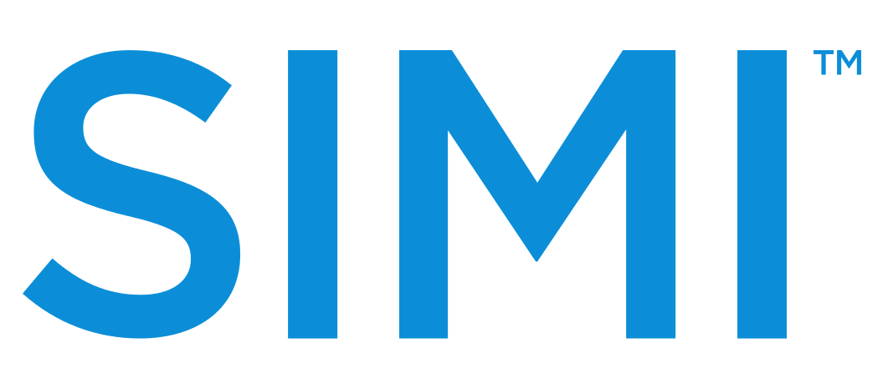

{:class="project-logo"}

# What is it?

SIMI is a digital menu for restaurants.  

The main intent of this product is to help restaurant managers increase their sales by showcasing their dishes with professional photos on a tablet. 

Everyone eats with their eyes first. 



Besides helping control the sales it also allows the waiter to suggest wines according to the dish you choose to eat automatically, allowing for better cross-sales without risking to be inconvenient by, for example, suggesting more expensive wines.

It also controls the sales because every order is registered online on our back office.

Other accessory operational features like calling the waiter or sending the requests to a screen on the kitchen are also included.

It also integrates with the main PoS (Point of Sales) systems in use in Portugal to send the requests to the kitchen and to invoice the clients appropriately having all the information also registered in the PoS.

So, to wrap it all up:

SIMI helps restaurants increase sales by showcasing their products in a intelligent and appealing way allowing final consumers to interact with the menu. SIMI provides:
- Easy to browse menu;
- Wine suggestions;
- Pictures that make people eat with their eyes;
- Change a daily menu in the tablet itself in minutes with immediate effect on all the tablets;
- Menu engineering with browsing statistics;
- Cross selling of dishes and selection of cooking options;
- Call waiter, Ask for the bill, Send billing information and Send orders directly to the kitchen;

# My path at SIMI

I am one of the co-founders of SIMI. I joined a small team (we were 5 in the beginning) to try and build a dreamy idea of revolutionizing the way restaurant businesses work all around the world. When I entered, I was only a software developer like all the others, but soon, decisions needed to be made and I naturally started to assume them, becoming the team leader.

## Inception

When it all started, it was just a simple idea. Restaurants had been around for millennia and still, most of the ordering process was made in a non-digital way. It seemed natural for us that at some point, this would have to change, and we wanted to be part of that change.

We started the company in April 2012 and in August we already wanted to participate in an event in Mozambique to show our new technology to an audience of potential clients and/or investors (one of the founders was already going there for other reasons, so we figured why not?). This gave us a deadline of 4 months to have something up and running.

The first iteration of SIMI (still not even called SIMI) was intended to be a menu that would integrate directly with the main PoS system, import all the dishes and allow for an easy creation of a menu. It was totally focused on improving the operations of a restaurant, meaning: to simplify requests, send them directly to the kitchen, reduce waiting times and that was mainly it.



We believed that it would be hard to ask for restaurant customers to install an APP on their cellphone just to place orders, so we thought that the easiest way to enter the market would be to give a menu to a customer that would be necessarily similar to what it was util then, meaning, the paper menu. A tablet is very similar in shape to a paper menu and can easily substitute the paper one without much change in the usual day-to-day of the waiters.

## First technical challenges

Because of this initial focus of ours, I immediately contacted the development team of the main PoS system in Portugal (I'm going to keep them unnamed for privacy reasons ;) ) at that time to discuss an integration.

Their software had been in the market for over 20 years and was widely implemented in restaurant businesses all over the country. But because of it's age, their were also some challenges to integrate, the PoS system had a simple API interface made in [XML-RPC](https://en.wikipedia.org/wiki/XML-RPC) that operated under a local server in each of the installations and it was built according to needs that evolved through time, meaning, it was not built according to any principles whatsoever. So it was a bit painful for us (and for them, because a lot of new endpoint had to be built) to integrate using our Java (Play Framework) back-end that had to connect with each of the local installations to import and then sync the categories and dishes with our menus.

We managed to built the demo for the Mozambique event and soon started to focus on building the back-office where the customers would configure their menus (at this point we just had a API and a mobile APP). We had an usable back-office in just 2 more months and started to focus on how to sell SIMI.



## Want it ALL - (Vision)

Since the beginning that we believed that SIMI as a menu in a tablet was the best way to get into the market fast. It was a hunch we got, and we firmly believed it. With our very small team of 5 it was impossible to imagine us building up strong marketing campaigns to convince in a B2C basis a lot of users to use SIMI on their phones, so instead we believed that if we entered the market with a tablet solution that only implied the restaurant owner to be convinced it would be much easier.

Nonetheless, our vision was still to have a more vertical solution around the restaurant dishes. As long as we had a good menu to sell, we could use it to generate, for example, a automatic website for the restaurant owners, we could provide a take away solution on a mobile app, we could allow for social sharing, etc. All of these solutions would be linked to a single, central information database managed only through our back-office, meaning, for example, that you would update a price of a dish and automatically it would be available on all your devices and platforms.



## Go to Market



After the initial product was built, we started to contact clients (mostly through our partnership with the PoS system that we integrated with). The very first to show some interest was Pulcinni, a nice italian restaurant in Leça da Palmeira.

Although it was nice to see our product finally working in a real client, we identified a lot of mistakes we have made along the way. A lot of adaptations had to be made for real usage of SIMI and to make it easy to transition between the paper menus and the digital ones.

## Company acquisition failure 

Really early in the process, the PoS system company that partnered with us started to gain interest in acquiring us. It was the obvious exit. We were completely integrated with them, so suddenly they could sell another product to their already existing clients, and they could easily engage with all their clients with a promotion or a trial, because they already had the means and the channel to offer this kind of deal to all their clients.

After a few negotiations we closed the acquisition deal with them verbally. SIMI was going to be sold to the PoS system company that partnered with us. I remembered thinking: "Oh my god! We were so fast to get an exit! We must be so good!". We celebrated.

A few months have gone by and still the deal has not become effective. We started to find this very weird and tried to accelerate the process with our partners.

Suddenly, we found ourselves without money to continue delaying the deal, and tried to force it to happen within our limited survival run-time. Our partners decided finally not to invest, and we were without money at all. We were very naive during the whole dealing process. But we can't help ourselves to think that this was a deliberate decision by our partners, as they then offered to absorb the whole company cost-free, just making sure all the employees would get their wage.

We spoke with all the employees about the situation and offered them all the possibility to go to our partners company and keep the wage, or continue with SIMI and work some months without certain wage until we could finance the project. All employees decided to stay and continue believing in the project.

The acquisition deal was off.

To finance the SIMI team we then managed to make a joint-venture with Kaizen Institute for us to build their Information System online, LeanHub, while still keeping some stake on the LeanHub project. Know more about it [here]({{ site.base_url }}/projects/leanhub).

## Fast Pivot

Although we got to a few clients quite fast, the partnership we've built to allow us to scale fast wasn't working as we had expected. The more than 200 resellers we had access to (because of our partnership with the PoS system), were typically technical support companies that were used to installing PoS systems for over 20 years, but had none or little contact with the tablet revolution that was happening at the time. So it was hard to teach them how to use a tablet or even install and configure an app. Besides that, our margins, although quite big in percentage, represented a small part in their monthly income, so it did not motivate them to excel at selling SIMI. Tablet margins were also really small so we couldn't convince them with the hardware that they were going to sell because of SIMI.

Because of this we tried to find other ways to sell massively SIMI and also started to understand that SIMI's main value to the clients was not the operational improvement, but the marketing effect it could generate with curiosity and the increase in sales it provoked for customers that had already gone in, meaning the ticket per meal was becoming greater for tables that in fact used SIMI, thanks to the images and cross selling of wines. 



When we realized that most of the value of the menu was in good professional pictures of the dishes, we realized that photographers also had an interest in the implementation of the SIMI Menu - it was the perfect reason for any restaurant to photograph all the dishes.

Taking this turn to focusing in the selling capabilities of SIMI instead of its operational advantage took us to another level. Photographers are more used to dealing with tablets and knew how to install SIMI. We started to recruit photographers, much like the AirBnB's strategy of having the best pictures of homes, we wanted to have the best pictures of dishes. 

This pivot was more in the business model and in the way we communicated SIMI rather than the product itself.

## PizzaHut deal

PizzaHut started to have interest in SIMI after a visit of the Head of PizzaHut Portugal to a restaurant that was already using SIMI.



For the successful implementation of the PizzaHut's menu, several features had to be tailor made for PizzaHut.

## 15 minutes of fame

Thanks to PizzaHut adhering to SIMI, we got a lot of media exposure:

 - [Público (P3)](http://p3.publico.pt/actualidade/economia/14010/jovens-criam-software-de-ementas-digitais-e-pizza-hut-ja-comprou-ideia)
 - [dinheiro vivo](https://www.dinheirovivo.pt/invalidos/ibersol-investe-4-milhoes-na-remodelacao-de-restaurantes-pizza-hut-e-lanca-phmenu/)
 - [Portugal Startups](http://portugalstartups.com/2014/10/pizza-hut-closes-deal-simi/)



We even showed up on television:



## Exit

Finally, after 4 years of involvement in the SIMI project, it was time for me to let it go and further myself in other projects. I decided to embrace the challenge of entering Infraspeak (know more about it [here]({{ site.base_url }}/projects/infraspeak)). 

We managed to get an exit. A big company in terms of technical support and PoS solutions distribution, with more than 400 clients, acquired SIMI and I still receive royalties for each sale that is made of SIMI.

# Technical Solution

On the technical side, SIMI is constituted mainly by a back-end a front-end and mobile app.

## Back-End

The back end was build with Play Framework 1.4 (Java) and a MySQL database. The cache system was Ehcache. This back-end was an API that was built according to RESTful and JSON API standards.

## Front-End (Back office)

SIMI's front-end was built using Foundation, Backbone.js, Underscore.js and jQuery.



## Mobile App (iOS and Android)

SIMI's mobile app was built using Sencha Touch and Ext. We decided to use these technologies because we had a very small team and it was easier to maintain the same codebase for both apps and because of performance reasons (at the time - 2012 - we tried all other technologies to encapsulate and found Sencha Touch to out perform the others). The web application was then encapsulated using Cordova and Phonegap into an Android and iOS apps.

## Others

We built another mobile application that never saw the light of day. It was the cellphone application. It was ready to browse all the restaurants around a certain GPS location, rate restaurants and it would allow to create dishes from pictures taken by the phone itself. I will just leave you guys with some pictures of it:







