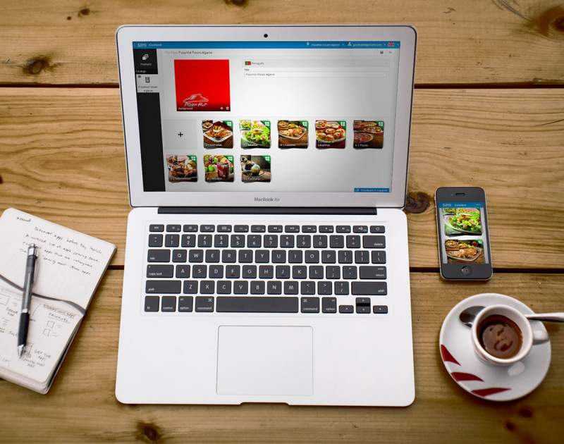
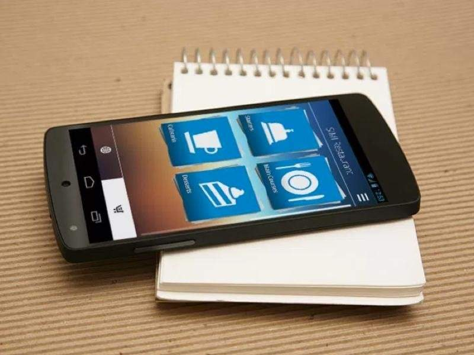

{:class="project-logo"}

# What is it?

SIMI is a digital menu for restaurants.  

Somos ementas digitais para restaurantes. 
O seu chefe é o melhor a cozinhar. Nós somos os melhores a comunicar os seus pratos. Porque "uma imagem vale mais do que mil palavras", o SIMI traz os seus pratos da cozinha para os olhos do seu cliente!

# My path at SIMI

## Inception

## First technical chalenges

## Go to Market

## Fast Pivot

## Company acquisition failure 

## PizzaHut deal

## 15 minutes of fame

## Investment

## Exit

# Technical Solution

## Back-End

## Front-End

## Mobile App

## Others

SIMI helps restaurants increase sales by showcasing their products in a intelligent and appealing way
allowing final consumers to interact with the menu. SIMI provides:
- Easy to browse menu;
- Wine suggestions;
- Pictures that make your clients eat with their eyes;
- Change your daily menu in the tablet itself in minutes with immediate effect on all the tablets;
- Menu engineering with browsing statistics;
- Cross selling of dishes and selection of cooking options;
- Call waiter, Ask for the bill, Send billing information and Send orders directly to the kitchen;
I was responsible for the R&D Team in charge of developing the SIMI Project.

