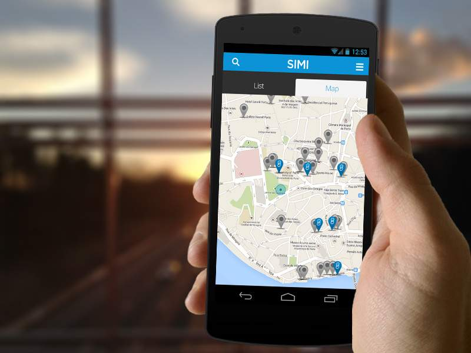

{:class="project-logo"}

# What is it?

SIMI is a digital menu for restaurants.  

The main intent of this product is to help restaurant managers increase their sales by showcasing their dishes with professional photos on a tablet. 

Everyone eats with their eyes first. 



Besides helping control the sales it also allows the waiter to suggest wines according to the dish you choose to eat automatically, allowing for better cross-sales without risking to be inconvenient by, for example, suggesting more expensive wines.

It also controls the sales because every order is registered online on our back office.

Other accessory operational features like calling the waiter or sending the requests to a screen on the kitchen are also included.

It also integrates with the main PoS (Point of Sales) systems in use in Portugal to send the requests to the kitchen and to invoice the clients appropriately having all the information also registered in the PoS.

# My path at SIMI

I am one of the co-founders of SIMI. I joined a small team (we were 5 in the beginning) to try and build a dreamy idea of revolutionizing the way restaurant businesses work all around the world.

## Inception

When it all started, it was just a simple idea. Restaurants had been around for millennia and still, most of the ordering process was made in a non-digital way. It seemed natural for us that at some point, this would have to change, and we wanted to be part of that change.

We started the company in April 2012 and in August we already wanted to participate in an event in Mozambique to show our new technology to an audience of potential clients and/or investors (one of the founders was already going there for other reasons, so we figured why not?). This gave us a deadline of 4 months to have something up and running.

The first iteration of SIMI (still not even called SIMI) was intended to be a menu that would integrate directly with the main PoS system, import all the dishes and allow for an easy creation of a menu. It was totally focused on improving the operations of a restaurant, meaning: to simplify requests, send them directly to the kitchen, reduce waiting times and that was mainly it.



We believed that it would be hard to ask for restaurant customers to install an APP on their cellphone just to place orders, so we thought that the easiest way to enter the market would be to give a menu to a customer that would be necessarily similar to what it was util then, meaning, the paper menu. A tablet is very similar in shape to a paper menu and can easily substitute the paper one without much change in the usual day-to-day of the waiters.

## First technical challenges

Because of this initial focus of ours, I immediately contacted the development team of the main PoS system in Portugal at that time to discuss an integration.

Their software had been in the market for over 20 years and was widely implemented in restaurant businesses all over the country. But because of it's age, their were also some challenges to integrate, the PoS system had a simple API interface made in [XML-RPC](https://en.wikipedia.org/wiki/XML-RPC) that operated under a local server in each of the installations and it was built according to needs that evolved through time, meaning, it was not built according to any principles whatsoever. So it was a bit painful for us (and for them, because a lot of new endpoint had to be built) to integrate using our Java (Play Framework) back-end that had to connect with each of the local installations to import and then sync the categories and dishes with our menus.

Whe managed to built the demo for the Mozambique event and soon started to focus on building the back-office where the customers would configure their menus (at this point we just had a API and a mobile APP). We had an usable back-office in just 2 more months and started to focus on how to sell SIMI.

## Go to Market



After the initial product was built, we started to contact clients (mostly through our partnership with the PoS system that we integrated with). The very first to show some interest was Pulcinni, a nice italian restaurant in Leça da Palmeira.

Although it was nice to see our product finally working for real in a client, we identified a lot of mistakes we made and tried to fix them fast so we could try to expand our sales.

## Fast Pivot

## Company acquisition failure 

## PizzaHut deal

## 15 minutes of fame

## Investment

## Exit

# Technical Solution

## Back-End

## Front-End

## Mobile App

## Others

SIMI helps restaurants increase sales by showcasing their products in a intelligent and appealing way
allowing final consumers to interact with the menu. SIMI provides:
- Easy to browse menu;
- Wine suggestions;
- Pictures that make your clients eat with their eyes;
- Change your daily menu in the tablet itself in minutes with immediate effect on all the tablets;
- Menu engineering with browsing statistics;
- Cross selling of dishes and selection of cooking options;
- Call waiter, Ask for the bill, Send billing information and Send orders directly to the kitchen;
I was responsible for the R&D Team in charge of developing the SIMI Project.

